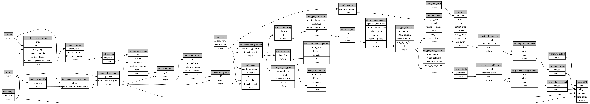

```
# AUTOGENERATED BY ECOSCOPE-WORKFLOWS; see fingerprint in README.md for details

```

```yaml
# fingerprint:
artifacts_sha256_basic: c788a7a0524a6f7f95e1041e80b4c217683b17ffc995e7808d4b41649a281a58
artifacts_sha256_strict: 6d37d006db95031f2f843e6b2a57fb2fbe515984a91f90ae1109d437543a3cb5
installed_requirements:
- channel: https://repo.prefix.dev/ecoscope-workflows/
  name: ecoscope-platform
  version: {version: ==2.16.1}
- channel: https://repo.prefix.dev/ecoscope-workflows-custom/
  name: ecoscope-workflows-ext-custom
  version: {version: ==0.1.0rc20}
- channel: conda-forge
  name: pydeck
  version: {version: ==0.9.2}
- channel: file:///tmp/ecoscope-workflows-custom/release/artifacts/
  name: ecoscope-workflows-ext-wd
  version: {version: ==0.0.2}
params_sha256: bb7a9ce3fdad0c2a5ba1f0848991d162442546f5efc091d3dfed690a6bbe0981
spec_sha256: 2303203843cfe6ca37d5be9b6baaabeeeb569ec4fc013850f7a330cc0e7f07e0

```

# ecoscope-workflows-etd-workflow


